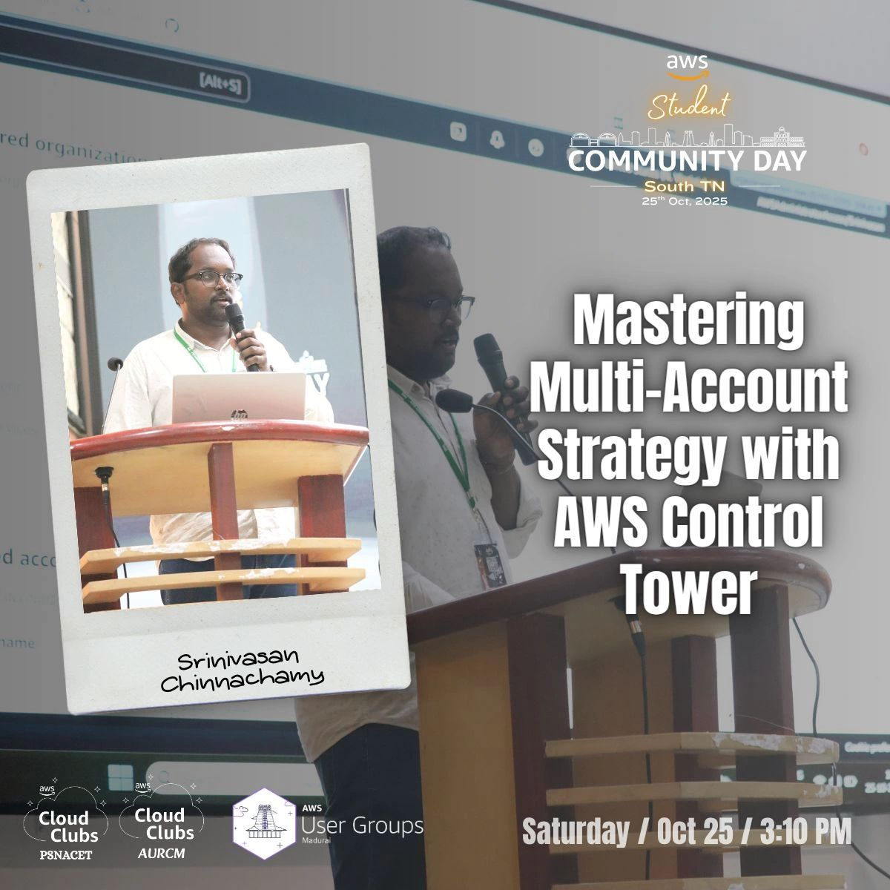
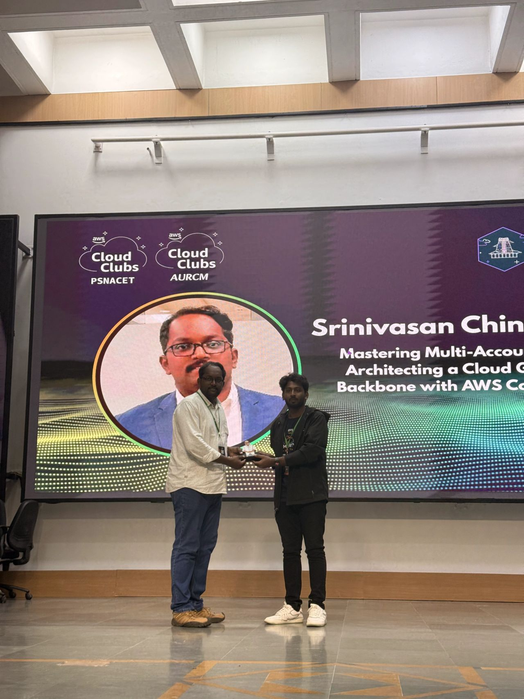
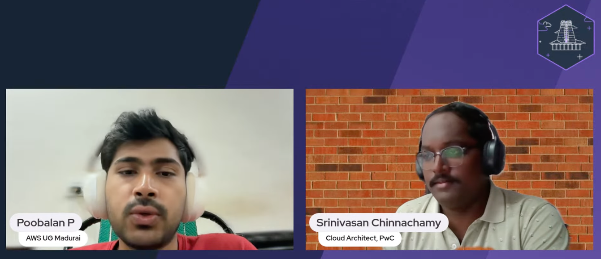
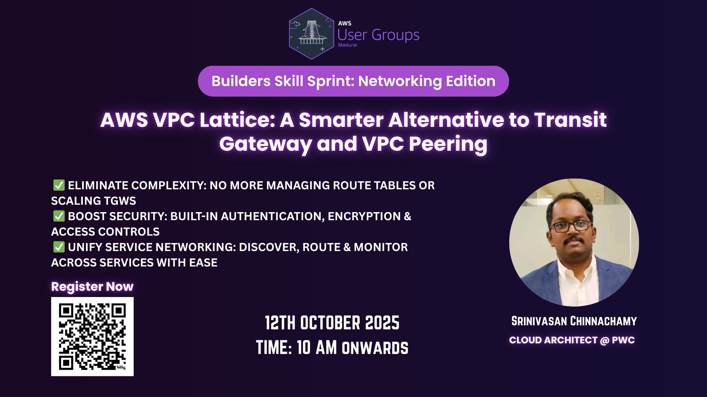
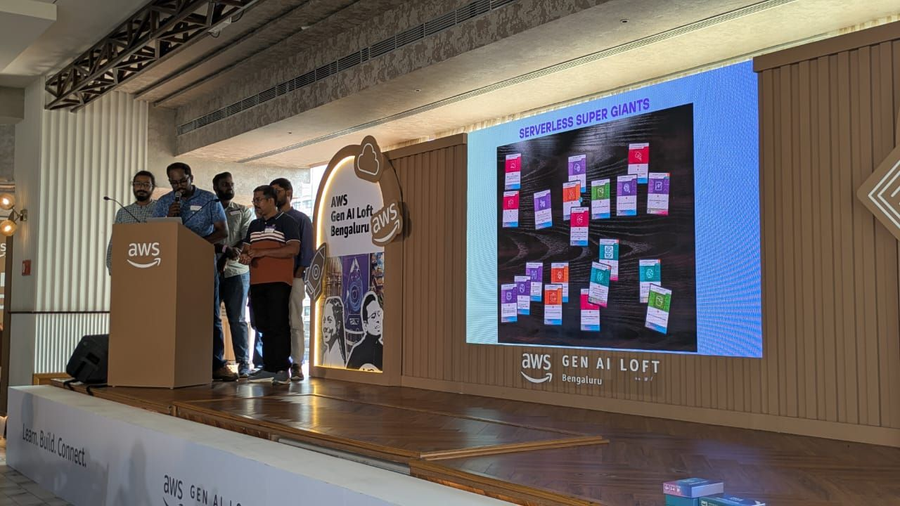
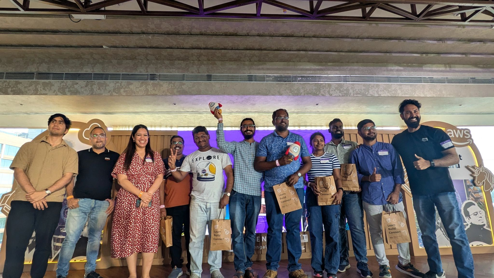
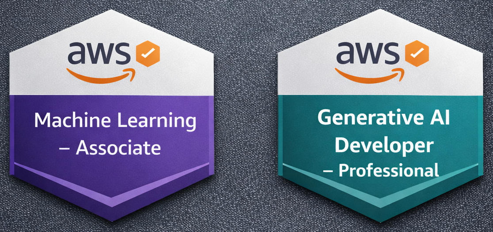

<!---
## About Me:
- 👨🏻‍💻 I am an AWS Cloud Architect
- 🎢 With over 10+ years of dedicated IT expertise, I bring a wealth of cloud experience coupled with strong analytical and technical leadership skills to the table.
- 📚 Believes in continuous upskilling with new set of tools and technologies
- ☁️ Passionate in explaining cloud computing and DevOps concepts
- 📬 You could reach me on LinkedIn @ Srinivasan Chinnachamy
-->

# 👋 Hi, I'm Srinivasan Chinnachamy

## ☁️🏗️ Cloud Architect | AWS | DevOps

##  About Me:
- 👨🏻‍💻 I am a **Cloud Architect**, Working with **PriceWaterhouseCoopers Acceleration Centers, Bengaluru, India**  
- 🎢 With over 10 years of dedicated IT expertise, I bring a wealth of experience coupled with strong analytical and technical leadership skills to the table
- 🎯 Specialized in building enterprise-scale cloud-native platforms and CI/CD automation
- 📚 Believes in continuous upskilling with expanding expertise in Generative AI and Agentic AI technologies
- 👨🏻‍🏫 Beyond my day-to-day responsibilities, I'm passionate about knowledge sharing. I've had the privilege of serving as a speaker, delivering tech talks on AWS User Groups and meet-ups
- ✍️ Technical content creator and begin writing articles on blogging sites 
        ↪ https://medium.com/@srinivasan.cloudarchitect 
        ↪ https://dev.to/srinivasan-cloudarchitect 
- 👷 Volunteer 
        ↪ Active member of AWS User Group Bengaluru, AWS User Group Madurai(AWS UG Community)
- 💬 Ask me anythig about AWS, Cloud Computing, Landing Zone Setup, Advanced Networking, CI/CD
- 🙌 I look forward to connecting with like-minded professionals and exploring opportunities to contribute to transformative tech initiatives. Let's connect and engage in meaningful discussions about the future of technology and its impact on our world.
- 📧 You can reach me at srinivasan.cloudarchitect@gmail.com or via LinkedIn @ [Srinivasan Chinnachamy](https://www.linkedin.com/in/srinivasan-aws/)

# Public Speaking Posts:

## 1. Speaker at AWS Student Community Day - South TN, Organised by AWS Cloud Club

Speaker at AWS Student Community Day - South TN and delivered a presentation on  **Mastering Multi-account Strategy with AWS Control Tower** for more than 300+ student audience at PSNA College of Engineering and Technology, Dindigul. The Session focused on establishing scalable, secure, and compliant multi-account environments. It outlined how Control Tower, Account Factory, and Service Control Policies (SCPs) together streamline governance, automate provisioning, and maintain centralized visibility—empowering organizations to innovate with confidence while ensuring operational excellence.

This event was organised by 
 - AWS Cloud Club - Anna University Regional Campus Madurai
 - AWS Cloud Club - PSNA College of Engineering and Technology, Dindigul

Presentation Material: [Mastering Multi-account Strategy with AWS Control Tower(pdf)](knowledgebase/Mastering-Multi-Account-Strategy-with-AWS-Control-Tower.pdf)

Speaker Mention: [AWS Student Community Day - Speaker Bio](https://scd.awsugmdu.in/#speakers)

LinkedIn Official event handle mention: 
 - [AWS AURCM Cloud Club](https://www.linkedin.com/posts/awscloudclubaurcm_aws-awsstudentcommunityday-awsdevelopers-activity-7389518953934483456-UxIA?utm_source=share&utm_medium=member_desktop&rcm=ACoAABArIgABKc0_7JuDJ91CEK9Ovgws7vRwgvE)
 - [AWS PSNA Cloud Club](https://www.linkedin.com/posts/psna-aws-cloud-club_aws-awscloudclubs-studentsaws-activity-7389851109814587392--SPb?utm_source=share&utm_medium=member_desktop&rcm=ACoAABArIgABKc0_7JuDJ91CEK9Ovgws7vRwgvE)

      

      

 

## 2. Speaker at Builders Skill Sprint - Networking edition, Organised by AWS User Group Madurai

Speaker at Builders Skill Sprint - Networking edition and delivered a virtual presentation on **AWS VPC Lattice: A Smarter Altnernative to Transit Gateway and VPC Peering** This session focussed on finding alternatives to traditional networking setup, service networking across VPCs/accounts, estabalishing Zero trust communication with built-in security, Unified layer for discovery, routing and observability. Session Recordings are hosted on AWS User Group-Madurai YouTube Channel

Presentation Material: [AWS VPC Lattice: A Smarter Altnernative to Transit Gateway and VPC Peering(pdf)](knowledgebase/VPC-Lattice-Smarter-Alternative-to-TransitGateway-and-VPCPeering.pdf)

Youtube Recordings: [AWS User Group Madurai-Builders Sprint - YouTube Channel](https://www.youtube.com/watch?v=hy_1FrItHMc&t=4710s)

LinkedIn Official event handle mention: [AWS User Group Madurai-Builders Sprint](https://www.linkedin.com/posts/awsugmdu_builders-skill-sprint-networking-month-activity-7382988519687958528-ey_k?utm_source=share&utm_medium=member_desktop&rcm=ACoAABArIgABKc0_7JuDJ91CEK9Ovgws7vRwgvE)
 

      

 

      

 

3. Title: Winning Builders Card Hackathon at AI Loft Event, Bengaluru

Description: Lead the team on builders card Hackathon to develop the idea, build the solution architecture within the provided tight timelines, presented to Jury and won the 1st prize. This Hackathon award was presented by Ridhima Kapoor(AWS) and Siddesh Jog(AWS) and was a part of AWS AI Loft Event, Bengaluru

Date: July 13, 2025 

      

      

 

## 📝 Read my insights: [Medium Blog](https://medium.com/@srinivasan.cloudarchitect)

### 🤖 AI
- [From Reactive Firefighting to Intelligent Triage: The Rise of AWS DevOps Frontier Agent](https://medium.com/@srinivasan.cloudarchitect/from-reactive-firefighting-to-intelligent-triage-the-rise-of-aws-devops-frontier-agent-9055dc0248d7)

- [Scaling Enterprise Security Reviews with AI: From Architecture to Pull Requests](https://medium.com/@srinivasan.cloudarchitect/scaling-enterprise-security-reviews-with-ai-from-architecture-to-pull-requests-9a6ff064b626)

- [From SDK to CLI: Making sense of Amazon Bedrock Namespaces and Avoiding CloudShell Pitfalls](https://medium.com/@srinivasan.cloudarchitect/from-sdk-to-cli-making-sense-of-bedrock-namespaces-and-avoiding-cloud-shell-pitfalls-b2b27e1fd1fc)

- [From Prototype to Runtime: Operationalizing AI Agents on Amazon Bedrock AgentCore](https://medium.com/@srinivasan.cloudarchitect/from-code-to-invocation-operationalizing-ai-agents-with-amazon-bedrock-agentcore-a28416ba5a5e)

- [Building SnakeXenzia with Amazon Q CLI](https://builder.aws.com/content/2xYAVfsSpjhyoFyamYLJ4yqlozN/building-snake-xenzia-with-amazon-q-cli)

### 🌐 Networking

- [AWS VPC Lattice: A Smarter Alternative to Transit Gateway and VPC Peering - Introduction](
https://medium.com/@srinivasan.cloudarchitect/aws-vpc-lattice-a-smarter-alternative-to-transit-gateway-and-vpc-peering-part-1-74a268f3cb7b)

- [AWS VPC Lattice: A Smarter Alternative to Transit Gateway and VPC Peering - DeepDive](
https://medium.com/@srinivasan.cloudarchitect/aws-vpc-lattice-a-smarter-alternative-to-transit-gateway-and-vpc-peering-deepdive-89f2f1e3afeb)

### ⚙️ AWS DevOps

- [Creating an automated DevOps pipeline for AFT repositories in AWS](
https://medium.com/@srinivasan.cloudarchitect/creating-an-automated-devops-pipeline-for-aft-repositories-in-aws-2ff73b609d31)

## 📚 Certifications Acheived:  
I'm 9x AWS Certified spanning from Foundational to Specialty domains

      

## 📚 Certifications In Progress: 
Preparation under-way to deepen my expertise

      

